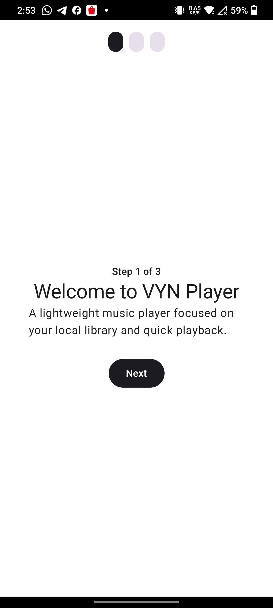
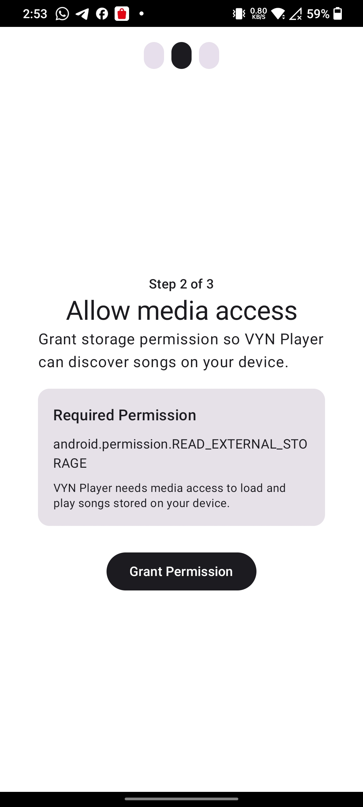
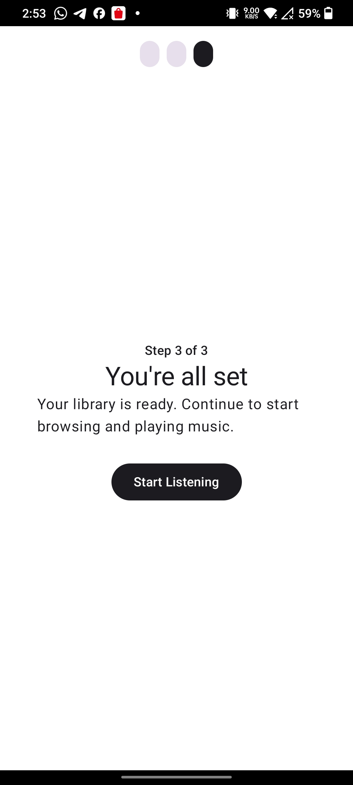
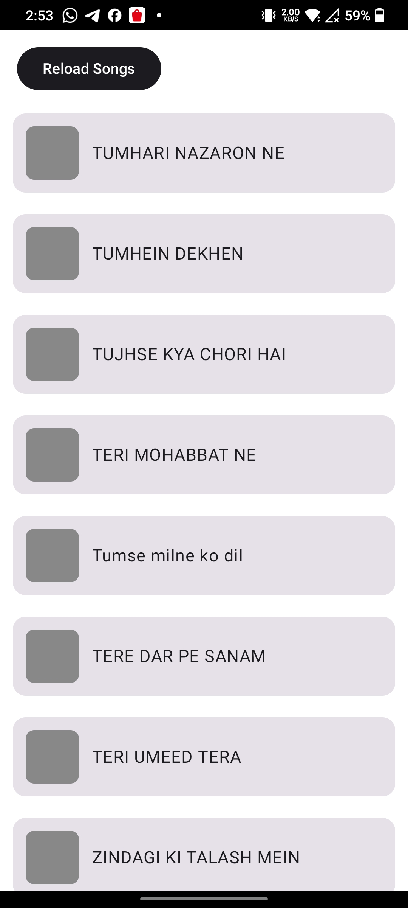

# 🎧 VYN Player

A modern Android music player focused on local playback, performance, and clean architecture.

## 🚧 Status

This project is currently under active development.

- Core features are functional
- UI/UX is being refined
- Additional features will be added progressively

## ✨ Current Features

- 🎵 Load songs from MediaStore
- ⚡ Fast loading with in-memory caching
- 🔁 Manual reload support
- 🔐 Permission handling via onboarding flow
- 📊 Debug logging system (`HOME_FLOW`, `REPO_FLOW`)
- 🧠 MVVM architecture with repository pattern

## 📸 Screenshots

### Screenshot 1

### Screenshot 2

### Screenshot 3

### Screenshot 4

## 🧠 Architecture

`UI → ViewModel → Repository → MediaStore`

- UI observes state from ViewModel
- ViewModel controls business logic
- Repository manages caching and data access
- MediaStore provides local audio data

## 🚀 Tech Stack

- Kotlin
- Jetpack Compose
- MVVM Architecture
- Android MediaStore API
- ADB-based testing workflow

## 📦 Installation

Download the latest APK from the Releases section.

## 🛣️ Roadmap

- Improved UI system and design consistency
- Mini player + full player screen
- Smooth animations and transitions
- Playlist and queue management
- Persistent storage (Room database)

## 👨‍💻 Development Approach

This project emphasizes:

- clean and scalable architecture
- real-device testing via ADB
- structured debugging using logs
- incremental feature development
